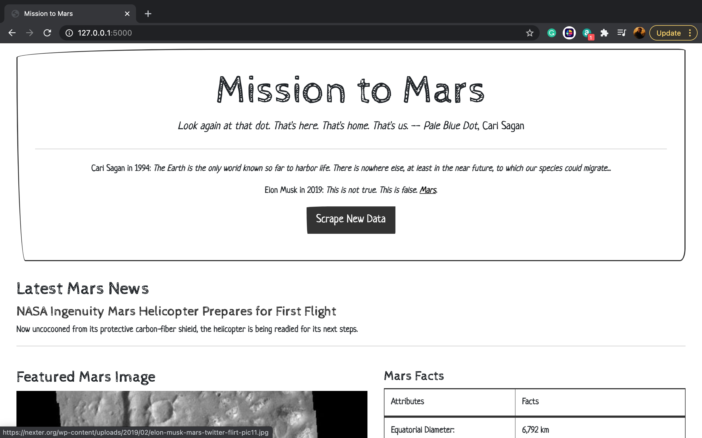
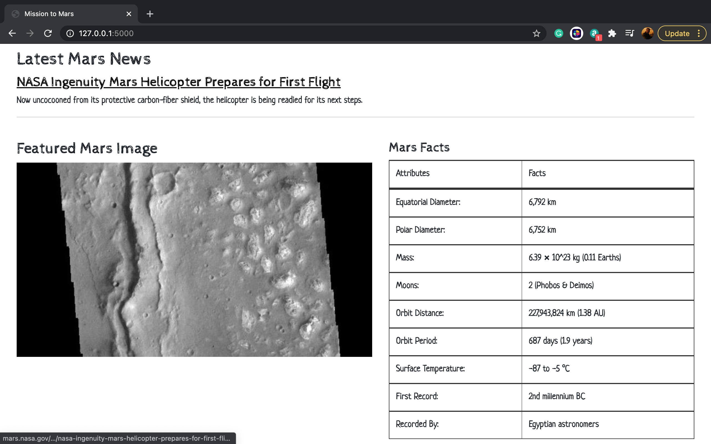
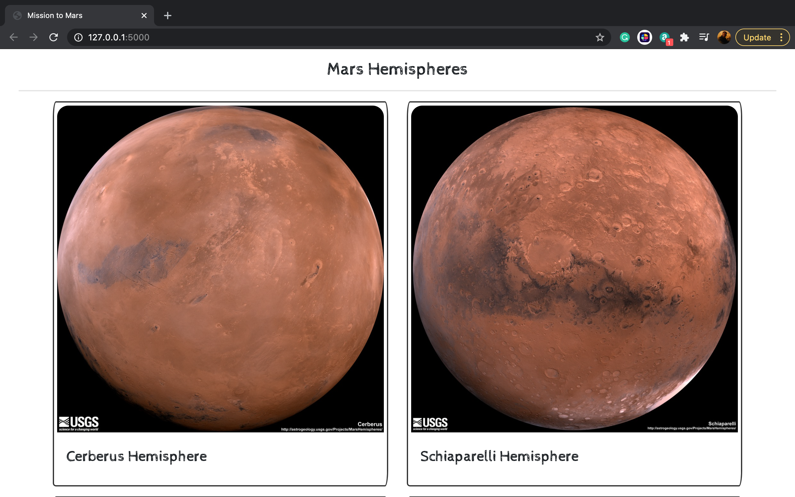
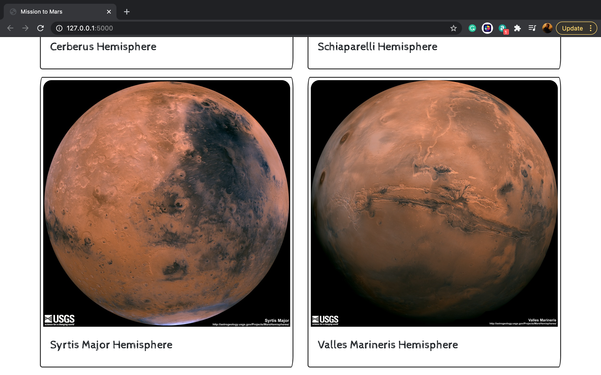

# Web Scrape: Mission to Mars

A web application that scrapes various websites for data related to Mars and displays the information in a single page using BeautifulSoup, Splinter, MongoDB, Flask framework, HTML, CSS, and Bootstrap.

## Preview of the application

Without running the code, go to "images_showcase" folder to see more previews on different sized screens.
